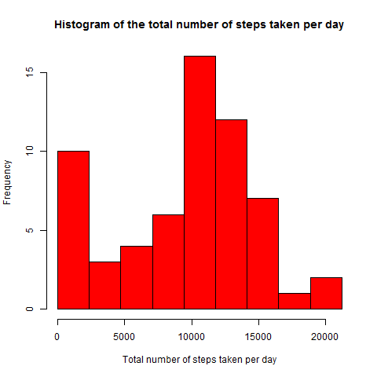
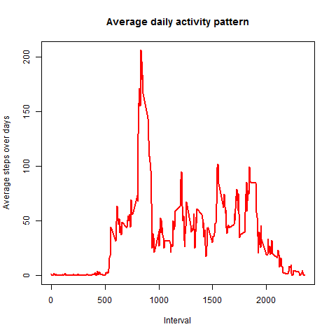
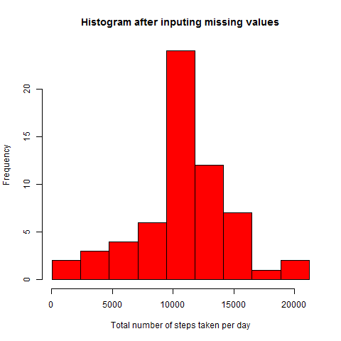
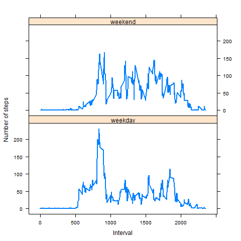

## Loading and preprocessing the data
We can download the zip file activity.zip and put it in R working directory. The following file reads the unziped activity.csv file.
```
unzip("activity.zip")
d<-read.csv("activity.csv")
```

## What is mean total number of steps taken per day?
We have used the following function (followed by its calling)in this section
```
myhist <- function(d){
  r<-split(d$steps,d$date)
  u<-length(unique(d$date))
  dd<-NULL
  for (i in 1:u){
    dd[i]<-sum(r[[i]],na.rm = TRUE)
  }
  ran<-range(dd)
  #Open png file and plot the histogram
  png(filename = "plot1.png", width = 480, height = 480, units = "px")
  hist(dd,breaks=seq(ran[1],ran[2],length=10),col="red",xlab = "Total number of steps taken per day", main = "Histogram of Total number of steps taken per day")
  ##hist(dd,breaks=seq(ran[1],ran[2],length=10),col="red",xlab = "Total number of steps taken per day", main = "Histogram after inputing missing values")
  dev.off()
  #Getting mean
  mm<-mean(dd)
  #getting median
  me<-quantile(dd,probs = 0.5)
  c(mm,me[[1]])
}
#calling the function
ss<-myhist(d)
```
We have found **Mean** = 9354.23 and **Median** = 10395.00 with the following figure
 


## What is the average daily activity pattern?
We have used the following function (followed by its calling)in this section
```
avgdac <- function(d){
  r<-split(d$steps,d$date)
  ui<-unique(d$interval)
  u<-length(ui)
  pp<-data.frame(r)
  dd<-NULL
  for (i in 1:u){
    dd[i]<-mean(as.numeric(pp[i,]),na.rm = T)
  }
  #Open png file and plot
  png(filename = "plot2.png", width = 480, height = 480, units = "px")
  plot(ui,dd,col="red",type = "l",main = "Average daily activity pattern",xlab = "Interval",ylab = "Average steps over days",lwd=2)
  dev.off()
  ind<-which.max(dd)
  list(ui[ind],dd)  
}
#Calling the function
#Plotting average daily activity pattern
gg<-avgdac(d)

```
With time interval 835, we have maximum average steps over days. We also have the following figure
 


## Imputing missing values
We use the mean for that 5-minute interval for the missing value. 
```
#inputing missing values
d<-read.csv("activity.csv")
#number of missing values rows
ind1<-is.na(d$steps)
nm<-sum(ind1)
r<-split(d$steps,d$date)
ui<-unique(d$interval)
u<-length(ui)
v<-length(unique(d$date))
pp<-data.frame(r)
dd<-NULL
for (i in 1:u){
  dd[i]<-mean(as.numeric(pp[i,]),na.rm = T)
}

newsteps<-rep(dd,v)
d$steps[ind1]<-newsteps[ind1]
myhist(d)

```
 Total number of missing values in the dataset = 2304
 
 Here, we have **Mean**= **Median**=  10766.19. We also have the following new histogram
 
## Are there differences in activity patterns between weekdays and weekends?
We have used the following R script 
```
#inputing missing values
d<-read.csv("activity.csv")
#number of missing values rows
ind1<-is.na(d$steps)
nm<-sum(ind1)
print(nm)
#Spliting by date
r<-split(d$steps,d$date)
ui<-unique(d$interval)
u<-length(ui)
v<-length(unique(d$date))
pp<-data.frame(r)
dd<-NULL
for (i in 1:u){
  dd[i]<-mean(as.numeric(pp[i,]),na.rm = T)
}

newsteps<-rep(dd,v)
d$steps[ind1]<-newsteps[ind1]

ee<-weekdays(as.Date(d$date))
ee[ee=="Monday"|ee=="Tuesday"|ee=="Wednesday"|ee=="Thursday"|ee=="Friday"]<-"weekday"
ee[ee=="Saturday" |ee=="Sunday"]<-"weekend"
af<-as.factor(ee)
d$indicator<-af
sp1<-split(d$steps,d$indicator)
#number of weekday in 61 days
wd<-length(sp1[[1]])/u
#For weekday
dd1<-NULL
ssp1<-data.frame(sp1[[1]])
for (i in 1:u){
  seq1<-seq(from=i,to=length(sp1[[1]]),by=u)
  dd1[i]<-mean(as.numeric(ssp1[seq1,]),na.rm = T)  
}

#number of weekend in 61 days
we<-length(sp1[[2]])/u
#For weekend
dd2<-NULL
ssp2<-data.frame(sp1[[2]])
for (i in 1:u){
  seq2<-seq(from=i,to=length(sp1[[2]]),by=u)
  dd2[i]<-mean(as.numeric(ssp2[seq2,]),na.rm = T)  
}
#Plotting figures
uii<-c(ui,ui)
dd3<-c(dd1,dd2)
f <- rep(0:1, each = u)
f <- factor(f, labels = c("weekday", "weekend"))
#Open png file and plot
png(filename = "plot4.png", width = 480, height = 480, units = "px")
xyplot(dd3 ~ uii | f,type="l",  layout = c(1, 2),xlab = "Interval",ylab = "Number of steps",lwd=2)
dev.off()
```
There is a difference in activity patterns between weekdays and weekends as showed in the following figure
 
